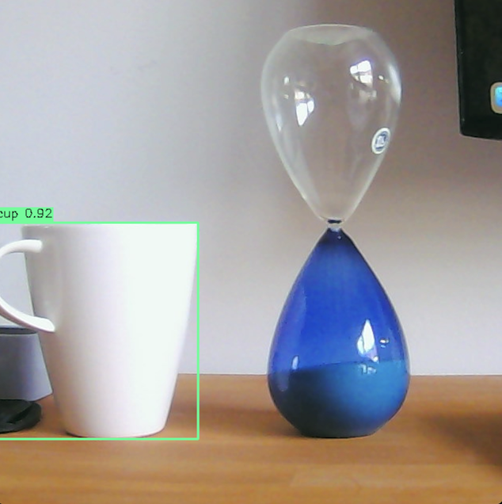

# seePlusPlus

This is an application to detect and track objects in C++ using Yolo (You only look once) with OpenCV.
It is used as an introduction project into machine vision with C++.

## Project Features

- Real-time object detection using YOLOv11 and OpenCV DNN module
- Configurable detection parameters (input size, confidence threshold, NMS threshold)
- Easy integration of custom ONNX models and class names
- Visualizes detection results directly on images
- Cross-platform build support (macOS, Windows, Linux)

## Requirements

- C++20
- OpenCV 4.12.0
- Cmake 4.1.0

## Setup

The project can be compiled on MacOs, Windows or Linux with _CMake_.
It is currently only tested on MacOs.

### MacOs

- Install C++ compilers and OpenCV according to the installation guide in [GeeksForGeeks](https://www.geeksforgeeks.org/installation-guide/how-to-install-opencv-for-c-on-macos/).

## Build

- CMake is used to build the project, making it independent of the platform.
- Predefined tasks in VS-Code can be used to build, compile and run/debug.

## Shortcuts

- _CMD + Shift + B_ to compile the project in VS-Code
- _CMD + Shift + R_ to run the executable in VS-Code

## Style Guide

Use the [Google C++ Style Guide](https://google.github.io/styleguide/cppguide.html#Self_contained_Headers).
