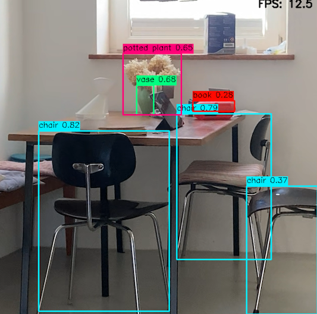
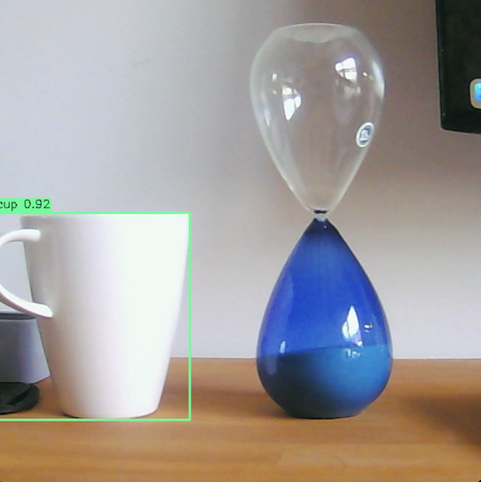

# seePlusPlus

This is an application to detect and track objects in C++ using Yolo (You only look once) with OpenCV.
It is used as an introduction project into machine vision with C++.
 

## Project Features

- Real-time object detection using YOLOv11 and OpenCV DNN module
- Configurable detection parameters (input size, confidence threshold, NMS threshold)
- Easy integration of custom ONNX models and class names
- Visualizes detection results directly on images
- Cross-platform build support (macOS, Windows, Linux)
- Docker image provided to build and run the application.

## Requirements

- C++20
- OpenCV 4.12.0
- CMake >= 4.1
- Docker

## Build

- The project can be compiled on MacOs, Windows or Linux with _CMake_.
- A Docker container is provided on Github:

```console
docker pull ghcr.io/njm08/seeplusplus-opencv:latest
```

- Build the script in the container with the script _/tools/build_scripts/build_cpp.py_.
- Predefined tasks in VS-Code can be used to build, compile and run/debug locally.

### MacOs

- Install C++ compilers and OpenCV according to the installation guide in [GeeksForGeeks](https://www.geeksforgeeks.org/installation-guide/how-to-install-opencv-for-c-on-macos/).

## Style Guide

This project uses the [Google C++ Style Guide](https://google.github.io/styleguide/cppguide.html#Self_contained_Headers).
